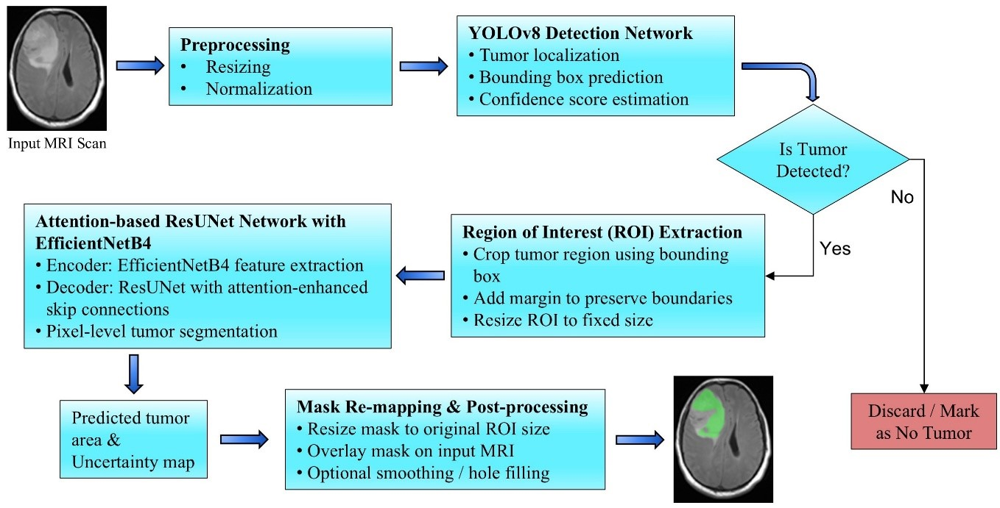
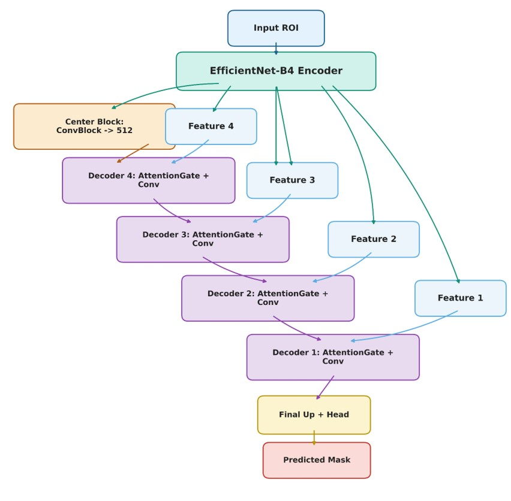
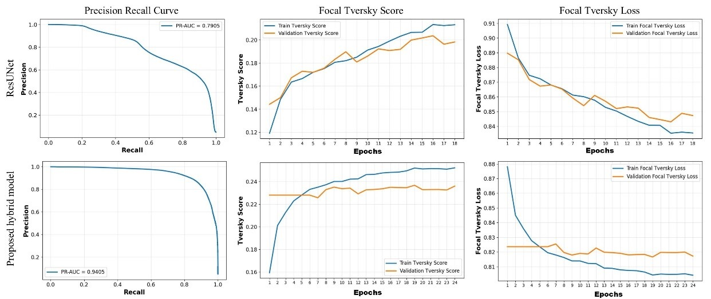
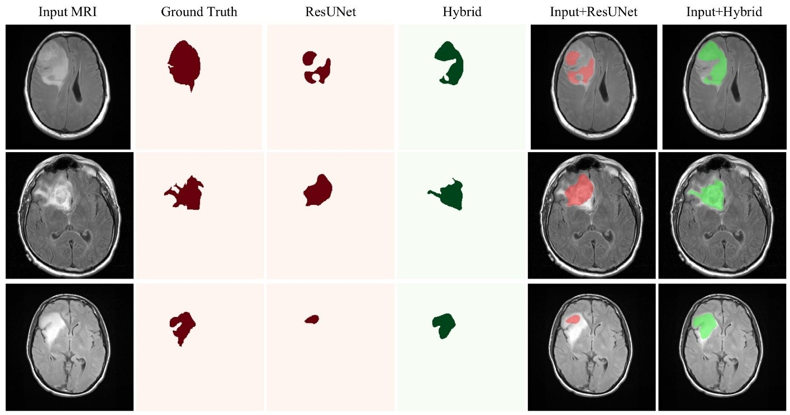

# Hybrid Deep Learning Approach for Low-Grade Gliomas Segmentation in MRI Scans

This repository contains the official implementation of our dual-stage hybrid framework designed for automated detection and high-precision segmentation of Low-Grade Gliomas (LGG) in brain MRI scans. 

Our work was successfully peer-reviewed and **presented** at the **IEEE RECCAP 2026** (International Conference on Recent Advances in Electronics, Communication, Computing, Automation and Power) hosted by **IIT Palakkad** (May 22-24, 2026)[cite: 2]. The final paper is currently in the publication pipeline.

---

## 📌 Project Overview
Traditional single-stage medical image segmentation models often struggle with high false-positive rates due to extensive background noise and severe class imbalance (where the tumor is tiny compared to the entire brain scan). 

To resolve this, we developed a **sequential pipeline** that first isolates the tumor region before segmenting it. By introducing a localization step, we filter out irrelevant non-pathological artifacts, allowing the segmentation network to focus entirely on the tumor-tissue interface.

### 🛠️ System Architecture
Our pipeline consists of four major stages:
1. **Preprocessing & Standardization:** MRI slices are resized and normalized using Z-score standardization.
2. **Tumor Localization (ROI Extraction):** A lightweight **YOLOv8 (nano)** network acts as a rapid region-of-interest (ROI) detector to estimate bounding boxes around the tumor. A precise margin is added to preserve critical edge details.
3. **Attention-Based Segmentation:** The isolated ROI is fed into an **Attention-ResUNet** built on top of a **EfficientNet-B4** backbone encoder. Attention Gates filter skip-connections to prioritize tumor boundary pixels.
4. **Optimization & Re-mapping:** The framework uses a custom **Focal Tversky Loss (FTL)** to heavily penalize false negatives, followed by morphological smoothing post-processing to reconstruct the final mask back onto the original image scale.

---

## 🖼️ Methodology & Visual Pipeline

### Proposed Framework Pipeline


### Core Segmentation Architecture


---

## 🚀 Key Features & Innovations
* **Detection-Driven Segmentation:** Drastically reduces class imbalance and global background noise by isolating the ROI before pixel classification.
* **EfficientNet-B4 + Attention Gates:** Utilizes compound scaling for intricate feature extraction and processes encoder features selectively to capture fine-grained boundary details.
* **Clinical Interpretability:** Generates both **Prediction Probability Maps** and **Uncertainty Maps** (using predictive entropy) to show clinicians exactly where boundary confidence drops.
* **Patient-Level Data Partitioning:** Built using 7,860 slices from 110 patients (from the Kaggle LGG Dataset), split strictly at the patient level (80% train / 20% test) to eliminate data leakage and ensure true clinical generalization.

---

## 📊 Performance & Evaluation Results

Tested against an independent test set of unseen patient profiles over 60 training epochs, our hybrid network significantly outperformed the baseline standard ResUNet across all structural, overlap, and reliability metrics:

### Quantitative Analysis

| Metric Category | Evaluation Metric | Baseline ResUNet | **Our Proposed Hybrid Model** |
| :--- | :--- | :---: | :---: |
| **Overlap & Accuracy** | Tversky Score | 0.95 | **0.97** |
| **Structural Integrity** | SSIM | 0.87 | **0.96** |
| | Dice Similarity Coefficient (DSC) | 0.74 | **0.97** |
| | Mean Intersection over Union (mIoU) | 0.72 | **0.96** |
| **Reliability Metrics** | Precision | 0.74 | **0.93** |
| | Recall (Sensitivity) | 0.78 | **0.94** |
| | PR-AUC Score | 0.79 | **0.98** |

### Performace Matrix


### Qualitative Segmentation Outputs
Our model achieves exceptionally close structural similarity to the ground-truth annotations across varied tumor shapes and scales. 



---

## 💻 Tech Stack
* **Deep Learning Framework:** PyTorch 
* **Object Detection:** Ultralytics YOLOv8 (nano)
* **Backbone Architecture:** EfficientNet-B4
* **Image Processing:** OpenCV, Scikit-Image, NumPy
* **Dataset Used:** [Kaggle Brain MRI Segmentation (TCIA-LGG)](https://www.kaggle.com/datasets/mateuszbuda/lgg-mri-segmentation)

---

## 📖 Citation & Conference Information

If you use this work or code in your research, please cite our conference paper:

```bibtex
@inproceedings{singh2026hybrid,
  title={Hybrid Deep Learning Approach for Low-Grade Gliomas Segmentation in MRI Scans},
  author={Singh, Arjeeta and Mrinalini and Basavarajappa, Lokesh and Bedi, Priyanshi},
  booktitle={IEEE International Conference on Recent Advances in Electronics, Communication, Computing, Automation and Power (RECCAP)},
  year={2026},
  organization={IEEE Malabar Subsection & IIT Palakkad}
}
Authors & Affiliation
Dr. Arjeeta Singh, Mrinalini, Dr. Lokesh Basavarajappa, Priyanshi Bedi

Mehta Family School of Biosciences and Biomedical Engineering, Indian Institute of Technology (IIT), Indore, India.
